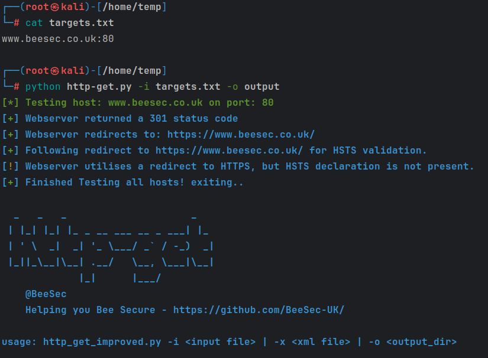

# http-get

A small Python-based toolkit to validate whether HTTP services are plaintext, redirect, and whether the redirect utilizes HSTS.

## Usage
<pre>
python http-get.py -i [input-file.txt] | -x [input-file.xml] | -o [output-directory]
</pre> 

